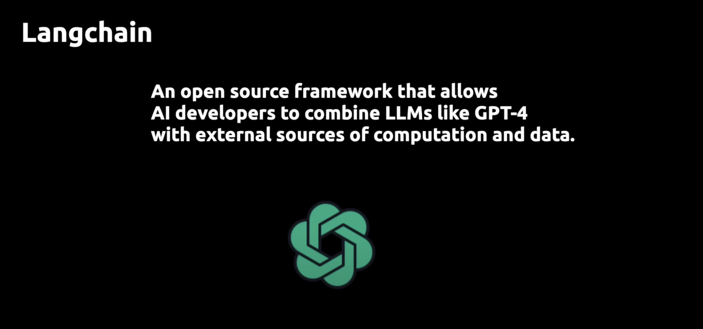
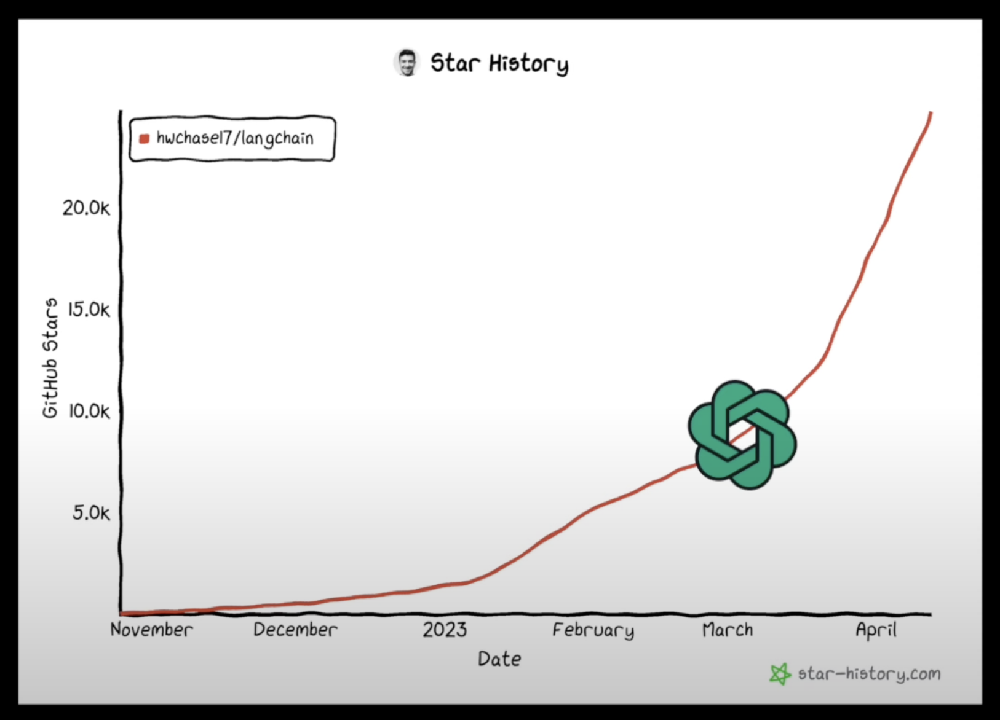
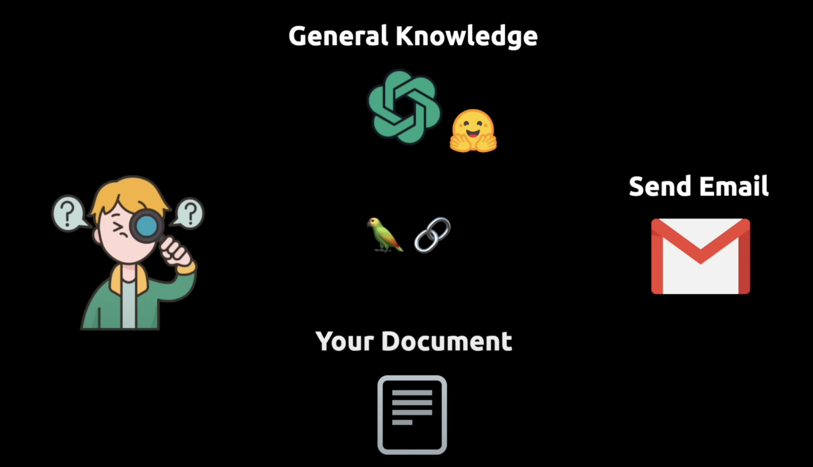
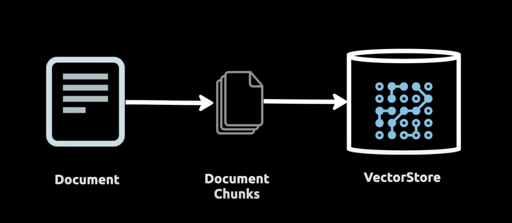
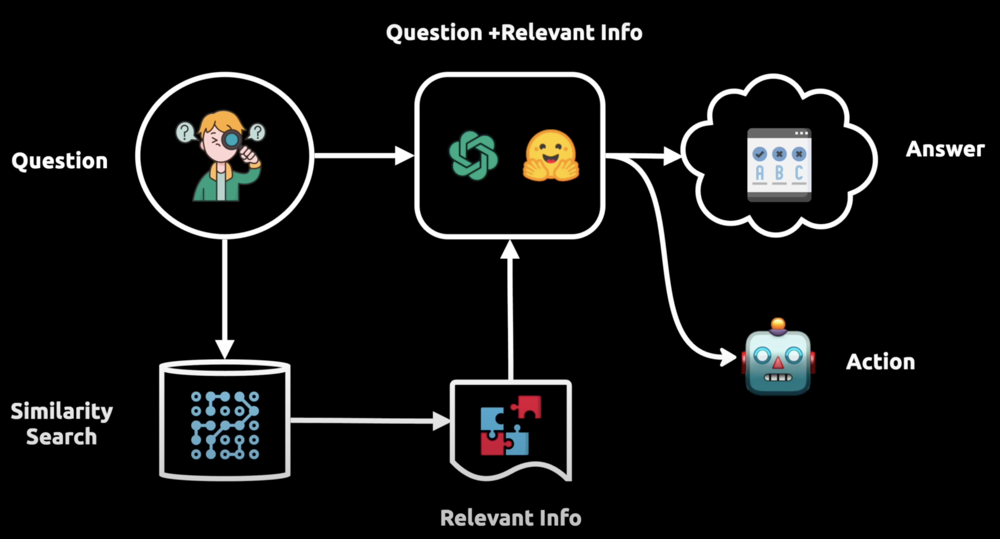
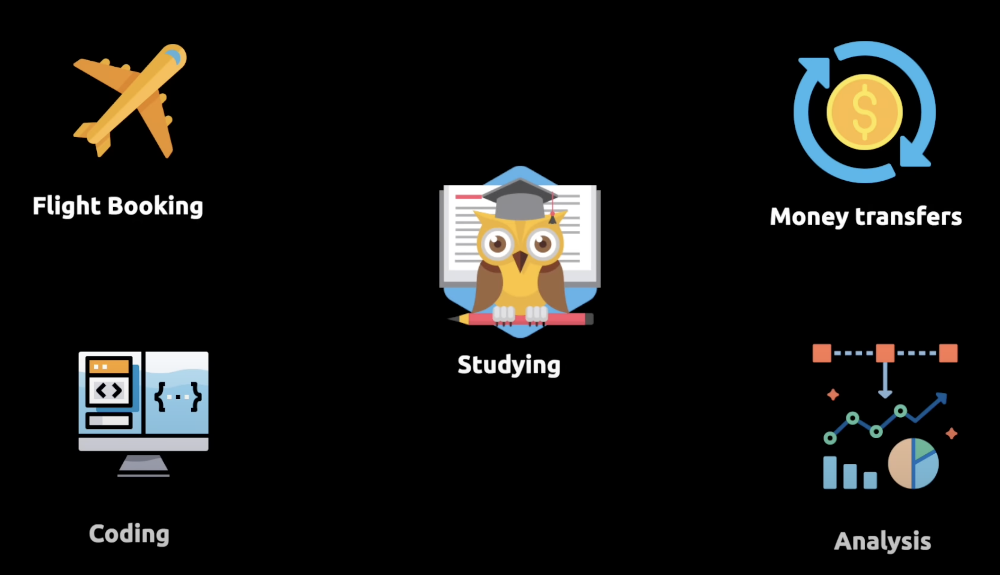
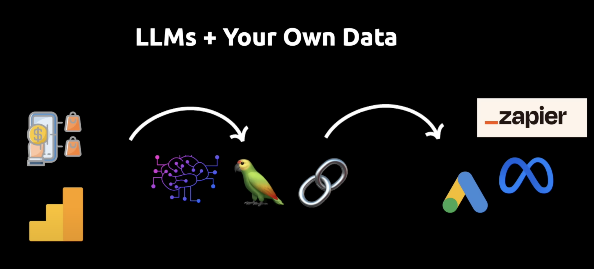
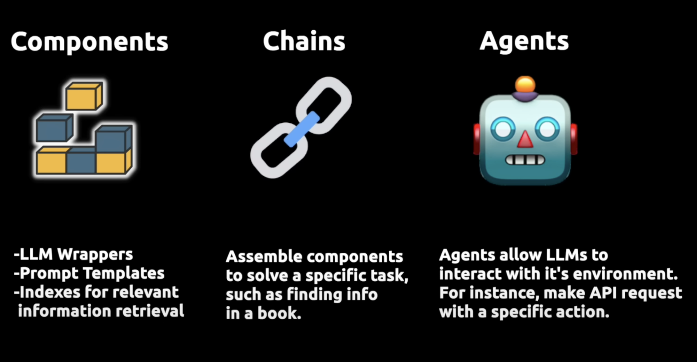
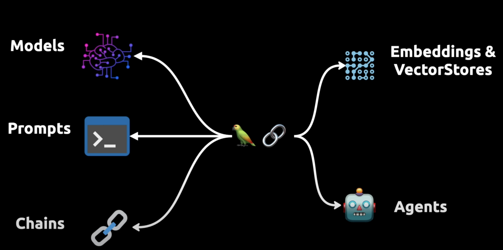

# Langchain

## Definition:

> Langchain frameworks currently offers Python, Javascript and Typescript.
> 

## 🤓 Popularity:

The popularity of the framework is exploding right now especially after the introduction of **gpt4**.

## 🛣️ Workflow:

Langchain allow you to connect LLM( large language model) to your own sources of data and you can ask **questions** not only questions also perform **actions** like sending an email. 

And the way we do that by taking the document , we want out language model to reference and then we slice it up to smaller chunks and we store those chunks into a vector database (**Pinecone**). And the chunks are stored as embeddings, mean the vector representation of the text data. 

### General PipeLine

A user asks an initial question and this question is then sent to the language model and a vector representation of that question is used to do a similarity search in the vector database. This allow us to fetch the relevant chunks of information from the vector database and feed that to the language model as well. And it’s then capable of providing answers and taking actions. 

A Langchain helps us to build application that follows the pipeline like this. And these applications of both data aware, we can reference our own data in a vector store and they are agentic , they can take actions. 

## Applications

And above two capabilities can open up infinite number of practical use cases. 

It allows LLM to interact with your data and also external API’s like Google’s or Meta’s APIs. 

## Main Value Proposition of Langchain

Main value proposition of langchain can be divided into following three main concepts. 

- **LLM Wrappers** that allow us to connect to large language models like GPT4 or from hugging Face.
- **Prompt templates** allows us to avoid having hard code text which is input to LLM
- **Indexes** allow us to extract relevant information for LLM
- **Chain** allow us to combine multiple components together to solve specific task and build entire LLM application
- **Agents** allow LLM to interact with external API’s

We have embedded vector stores which are indexes. 

gpt3.5 or gpt4 are **chat models**. In order to interact with chat models we’re going to import schema consisting of three parts

1. AI Message
2. Human Message
3. System message ( system message is what you use to configure a system)

**Prompt templates** handle prompts dynamically.

**Chain**: chain takes a language model and a prompt template and combine them into an interface that takes input from the user and output the answer from the language model. It’s like a composite function where the inner function is the prompt template and the outer function is the language model.

We can also build sequential chain where we have one chain returning an output and then second chain taking the output from the first chain as an input.

**Embeddings** converts text into vector representation of that text. We can use openAI embedding model Ada for that.